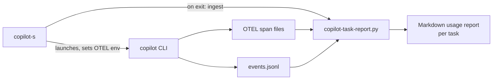

# copilot-cli-toolkit

Personal-workflow tooling for the [GitHub Copilot CLI](https://github.com/github/copilot-cli):
a session manager with automatic per-task usage/cost reporting, and a
6-role multi-agent implementation pipeline (planner → coder → reviewer →
fixer → tester → test-reviewer).

Both pieces are independent — use the session manager without the agent
pipeline, or vice versa.

## Why

The Copilot CLI is powerful but, out of the box, gives you no persistent
cross-directory session list, no automatic usage/cost accounting tied to
your actual task work, and no opinionated structure for multi-step
implementation tasks. This toolkit adds all three as a thin, inspectable
layer around the stock CLI — it never forks or patches `copilot` itself.

## Features

- **Global session manager** (`copilot-s`) — list, resume, rename, and
  delete Copilot CLI sessions across every directory, not just the one
  you're in.
- **Automatic per-task usage reports** — every session exit appends
  token counts, model-call time, reasoning-effort intent, and an estimated
  USD cost to a cumulative Markdown report for the task associated with
  your current git branch (or a free-form task name/ID you provide).
- **6-role agent pipeline** — `planner`, `coder`, `reviewer`, `fixer`,
  `tester`, `test-reviewer`, wired together by an orchestrator so
  non-trivial tasks get planned, implemented, reviewed, tested, and
  re-reviewed before being considered done.
- **User-editable pricing table** — add or correct model USD rates in one
  JSON file; unpriced models are reported as "no pricing data", never
  silently as $0.
- **Symlink-based install** — the repo is the source of truth; `git pull`
  (or `scripts/update.sh`) updates your live tools immediately, no
  re-install step required.

## Architecture



See [`docs/architecture.md`](docs/architecture.md) for the full breakdown,
including the multi-agent pipeline diagram and ingest/idempotency design.

## Example report output

```markdown
# Copilot Task Usage Report — ABC-123

- Report last updated: 2026-09-20T14:03:11Z
- First recorded: 2026-09-18T09:12:45Z
- Copilot sessions contributing: 3

## Summary

| Metric | Value |
|---|---|
| Model calls | 42 |
| Prompt (input) tokens | 186,204 |
| ...of which cache-read tokens | 61,880 |
| Completion (output) tokens | 24,517 |
| Total tokens | 210,721 |
| Model-call time | 18m 32s |
| Estimated USD cost (independent pricing table, approximate) | $1.84 |

## By Model
| Model | Calls | Total Tokens | Est. USD |
|---|---|---|---|
| claude-sonnet-5 | 30 | 175,004 | $1.42 |
| gpt-5.4-mini | 12 | 35,717 | $0.42 |
```

(Illustrative — no real task IDs, tokens, or costs; generated from
synthetic data for documentation purposes.)

## Requirements

- macOS or Linux with Bash ≥ 3.2 (the default macOS `/bin/bash` works; no
  Bash 4+ features are used).
- Python 3.7+ (stdlib only — no dependencies to install).
- [GitHub Copilot CLI](https://github.com/github/copilot-cli) (`copilot`)
  installed and on `PATH`.
- `git` (for task-key-from-branch detection, and for `scripts/update.sh`).

## Quick install

```bash
git clone https://github.com/<you>/copilot-cli-toolkit.git ~/copilot-cli-toolkit
cd ~/copilot-cli-toolkit
scripts/install.sh --dry-run   # preview what will change
scripts/install.sh              # symlink executables, agents, and instructions into place
```

This installs:

| What | Installed to | Method |
|---|---|---|
| `copilot-s`, `copilot-task-report.py` | `~/.local/bin/` | symlink by default (or plain file copy with `--copy`) |
| 6 agent definitions | `~/.copilot/agents/` | symlink (or copy with `--copy`) |
| Orchestrator instructions | `~/.copilot/copilot-instructions.md` | symlink (or copy with `--copy`) |
| Pricing table | `~/.copilot/task-reports/model-pricing.json` | **copied once, only if absent** — your edits are never overwritten |

Make sure `~/.local/bin` is on your `PATH`. Any pre-existing file at an
install destination is backed up (never deleted) before being replaced —
see `scripts/install.sh --help`.

> **Symlink mode and your checkout are linked.** By default every installed
> file (except the pricing table) is a symlink pointing back into *this*
> repo checkout. That's what makes `git pull` / `scripts/update.sh`
> instantly update the live tools — but it also means **moving or deleting
> this checkout breaks the installed commands** (`copilot-s` will fail with
> a "No such file or directory" style error, since the symlink now points
> nowhere). If you need to relocate the checkout, either re-run
> `scripts/install.sh` from the new location (it will re-link everything in
> place), or install with `--copy` up front if you'd rather have
> self-contained copies that don't depend on the checkout's location at all
> (at the cost of no longer auto-updating on `git pull`).

## Usage

```bash
copilot-s                     # list sessions relevant to the current directory
copilot-s --all               # list every session, across all directories
copilot-s --report ABC-123    # print/regenerate the cumulative usage report for a task
copilot-s --task ABC-123      # alias for --report (kept for convenience; --report is
                               # the canonical/documented flag name for this toolkit)
copilot-s --help               # show usage/features and exit (safe: never launches copilot)
copilot-s --version | -v       # print the copilot-s version and exit (safe: never launches copilot)
```

From the session list you can resume, rename, or delete sessions
(single/range/multi-select). On exiting a `copilot` session you'll be
prompted to keep, rename, or delete it.

## Task usage reporting

> **Upgrading from a pre-2.0 checkout?** This was previously Jira-specific
> (`copilot-jira-report.py`, `~/.copilot/jira-reports/`,
> `~/Desktop/CopilotJiraTaskReports`). 2.0.0 renames everything to generic
> "task" terminology with no compatibility shim — but your existing data
> is migrated automatically and idempotently the first time you run
> `scripts/install.sh` or use `copilot-s`/`copilot-task-report.py` after
> upgrading. See the [CHANGELOG's 2.0.0 entry](CHANGELOG.md) for exactly
> what moves and how conflicts/edits are preserved.

### How task attribution works

1. `copilot-s` tries to extract a conservative `KEY-123`-style ID (e.g. an
   issue-tracker key) from your current git branch name.
2. If that fails and it's a resumed session, it falls back to the branch
   stored when that session was created.
3. If that fails and it's a **brand-new** session, you're prompted once
   for a task ID or free-form task name (with input validation and
   retries); leaving it blank assigns `UNASSIGNED`. Resumed sessions are
   never re-prompted.

### Configuration

- `COPILOT_TASK_REPORTS_DIR` — override where Markdown reports are written
  (default: `~/Desktop/CopilotTaskReports`).
- `~/.copilot/task-reports/model-pricing.json` — edit freely to add new
  models, correct rates, or map an alternate model id to an existing priced
  entry via the `aliases` map. This file is never overwritten by
  `scripts/install.sh` once it exists.

### Limitations

- Usage is tracked only from the moment the toolkit is first used on a
  machine; existing session history is never backfilled.
- Requires OTEL export to actually work with your installed Copilot CLI
  version (`copilot-s` sets `COPILOT_OTEL_ENABLED=true` and a file exporter
  path); if your CLI build doesn't honor it, only auxiliary-call/checkpoint
  data from `events.jsonl` will be reflected.
- If a session's telemetry files are deleted before ingestion runs (outside
  the normal `copilot-s` exit flow), that increment is permanently lost.
- **No automatic retention/cleanup policy for OTEL span files or other
  telemetry state** under `~/.copilot/otel/` (or `events.jsonl`/checkpoint
  state): this toolkit never prunes, rotates, or expires them on its own.
  They accumulate indefinitely until ingested, and this toolkit does not
  delete them for you afterward either. Do **not** manually delete active
  telemetry files before `copilot-s`'s normal exit-time ingestion has run
  for that session — doing so causes the same permanent data loss as the
  point above. Manual, periodic pruning of old/already-ingested files is
  safe if you want to reclaim disk space, but is left entirely to you;
  automating that pruning safely (i.e. never touching not-yet-ingested
  data) is a known, deliberately-unimplemented gap — see
  [`docs/architecture.md`](docs/architecture.md) — rather than something
  this toolkit currently risks doing automatically.
- The estimated USD cost is an independent approximation from a
  locally-maintained pricing table — not an official Copilot invoice, and
  it will drift from actual billing.
- **Legacy Desktop-reports migration only looks in the hardcoded default
  pre-2.0 location** (`~/Desktop/CopilotJiraTaskReports`). If you had
  customized the old `COPILOT_JIRA_REPORTS_DIR` env var to point your
  legacy reports somewhere else, that custom location is **not**
  auto-discovered (the env var itself is gone in 2.0.0 — see the
  [CHANGELOG](CHANGELOG.md) — so there is nothing left for this toolkit to
  read it from), and those reports will **not** be migrated automatically.
  If this applies to you, move/copy your old reports directory to the
  default `~/Desktop/CopilotJiraTaskReports` path yourself before first
  running `scripts/install.sh` or `copilot-s` after upgrading, so the
  automatic migration picks them up; otherwise they're simply left where
  they are (never deleted, but also never merged into the new
  `~/Desktop/CopilotTaskReports` location).
- Copilot-internal nano-AIU/premium-request figures are opaque accounting
  units reported by Copilot itself, kept separate from the USD estimate.

See [`docs/architecture.md`](docs/architecture.md) for the full list of
documented tradeoffs.

## Agent pipeline

| Role | Purpose | Example model¹ |
|---|---|---|
| `planner` | Turns a task into an ordered implementation plan before any code is written | `claude-sonnet-5` |
| `coder` | Implements the plan with complete, working changes | `claude-sonnet-5` |
| `reviewer` | Flags correctness/design issues in the coder's diff; doesn't rewrite | `claude-opus-5` |
| `fixer` | Applies targeted fixes for issues raised by reviewer/test-reviewer | `claude-sonnet-5` |
| `tester` | Writes and runs tests to validate the implementation | `kimi-k2.7-code` |
| `test-reviewer` | Final quality gate: checks test coverage/trust before sign-off | `claude-opus-5` |

¹ Models listed in each `agents/*.agent.md` file are current, working
examples — not a recommendation frozen in time. Edit the `model:`
frontmatter field to whatever your Copilot CLI installation currently
supports (check with `/subagents` in a session); the pipeline logic in
`instructions/copilot-instructions.md` doesn't depend on which models are
assigned.

The orchestrator (`instructions/copilot-instructions.md`, auto-loaded every
session) enforces the pipeline order and the review/fix and test/fix
loops. Trivial one-line changes can skip straight to `coder`; anything
touching multiple files or with design ambiguity should go through
`planner` first.

Verify the pipeline is loaded:

```
/agent          # lists all 6 custom agents
/env            # shows loaded agents/instructions in detail
/subagents       # shows/lets you change each agent's assigned model
```

## Configuration reference

| Setting | Where | Default |
|---|---|---|
| Task reports directory | `COPILOT_TASK_REPORTS_DIR` env var | `~/Desktop/CopilotTaskReports` |
| Model pricing | `~/.copilot/task-reports/model-pricing.json` | copied from `config/model-pricing.json` on first install |
| Executables install prefix | `scripts/install.sh --prefix DIR` | `~/.local/bin` |
| Install method | `scripts/install.sh --copy` | symlink |

## Security & privacy

- Everything runs locally; no telemetry is sent anywhere by this toolkit
  itself (the Copilot CLI's own telemetry is a separate concern — see
  GitHub's documentation).
- Task IDs, tokens, and cost data are stored only in your own
  `~/.copilot/task-reports/` directory and your reports directory —
  nothing is transmitted or shared by these scripts.
- The pricing table contains only public, independent list-price
  approximations — no account, billing, or credential data.
- See [`SECURITY.md`](SECURITY.md) for how to report a vulnerability.

## Uninstall / update

```bash
scripts/uninstall.sh --dry-run           # preview
scripts/uninstall.sh                     # remove only toolkit-managed files/symlinks
scripts/uninstall.sh --restore-backups   # also restore whatever was backed up at install time

scripts/update.sh                        # git pull --ff-only, then re-run the installer
```

Uninstalling never touches usage reports, task/session ingest state,
your pricing config, or Copilot session state — only the symlinks/copies
this toolkit created.

## Roadmap

- [ ] Optional Homebrew formula / package for install.
- [ ] Linux CI coverage expansion beyond current smoke tests (broader shell
      matrix).
- [ ] Pluggable issue-tracker backends beyond `KEY-123`-style keys.

## Contributing

See [`CONTRIBUTING.md`](CONTRIBUTING.md). Issues and PRs are welcome —
please run `python3 -m unittest discover -s tests -v` (covers both
`tests.test_copilot_task_report` and `tests.test_copilot_s`) and
`bash -n bin/copilot-s scripts/*.sh` before submitting.

## License

[MIT](LICENSE)
