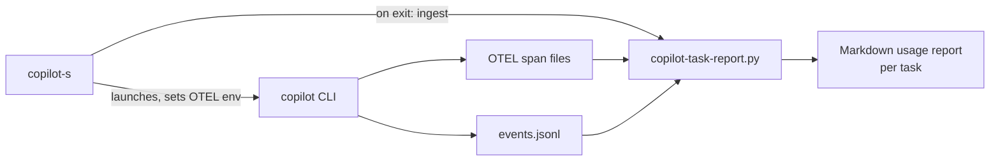

# copilot-cli-toolkit

Personal-workflow tooling for the [GitHub Copilot CLI](https://github.com/github/copilot-cli):
a session manager with automatic per-task usage/cost reporting, and a
7-role multi-agent implementation pipeline (discovery/planner → coder/
senior-coder → reviewer → tester → test-reviewer) with cost-aware, bounded
routing — all source/code changes (production source, tests including
tester-authored tests, scripts, Storybook stories, and executable or
behavior-affecting configuration) receive independent review;
discovery, planning, and testing remain conditional.

Both pieces are independent — use the session manager without the agent
pipeline, or vice versa.

## Why

The Copilot CLI is powerful but, out of the box, gives you no persistent
cross-directory session list, no automatic usage/cost accounting tied to
your actual task work, and no opinionated structure for multi-step
implementation tasks. This toolkit adds all three as a thin, inspectable
layer around the stock CLI — it never forks or patches `copilot` itself.

## Copilot Auto mode vs. this toolkit

Copilot's `/model auto` setting and this toolkit solve different problems.
Auto mode lets Copilot dynamically choose a model for the current work.
This toolkit adds workflow policy *around* Copilot: session management,
task-level reporting, custom roles, explicit model defaults, bounded loops,
and conditional stage routing with mandatory independent review for
source/code changes, including tests and behavior-affecting configuration
even when they add no executable behavior. Pure prose/documentation and
mechanical git-only operations are normally exempt.

The toolkit is **not automatically better, smarter, or more reliable than
Auto mode**. Auto is maintained by GitHub and can adapt as models and routing
improve. The toolkit is useful when you prefer more control and repeatability,
and accept the maintenance and orchestration overhead that comes with it.

| Area | Copilot Auto mode | This toolkit |
|---|---|---|
| Model selection | Copilot chooses dynamically based on the current request | Each custom role has a visible default model, with personal overrides available through `/subagents` |
| Workflow | Flexible; Copilot decides whether and how to delegate | A documented task-tier policy decides which roles run; all source/code changes, including tests and behavior-affecting configuration, receive independent review |
| Cost control | Relies mainly on Copilot's automatic routing and account limits | Uses cheaper routine roles, tiered reviewer routing, conditional stages, and bounded review/test loops |
| Role separation | May handle planning, implementation, review, and testing in one session | Separates discovery, planning, production coding, review, and testing into narrowly-scoped roles |
| Repeatability | Routing may change as Auto evolves or as prompts differ | Agent files and instructions are inspectable, version-controlled defaults |
| Session management | Uses Copilot CLI's native session commands | Adds a global cross-directory session list, bulk deletion, naming, and exit-time keep/rename/delete prompts |
| Usage reporting | `/usage` reports session usage interactively | Creates cumulative per-task Markdown reports with models, tokens, time, effort attribution, and estimated cost |
| Maintenance | Lowest maintenance; GitHub updates the routing | You maintain agent prompts, model defaults, pricing data, and compatibility with future CLI changes |

### Which should you use?

- **Use Auto alone** when you want the simplest experience, trust GitHub's
  model routing, and do not need this toolkit's session/reporting features or
  explicit development stages.
- **Use the toolkit's agent defaults** when repeatable role boundaries,
  visible model choices, cost budgets, and review/test discipline matter more
  than fully automatic routing.
- **Use both together (recommended for most users):** keep the main Copilot
  session on Auto, while custom subagents use their role-specific defaults.
  Auto can handle normal conversation and orchestration; the toolkit supplies
  the session manager, task reports, and reusable role definitions.

### Reliability caveat

The agent pipeline is implemented with Copilot custom-agent profiles and
instructions, not a separate deterministic workflow engine. The model can
still decide that a stage is unnecessary or handle work in the main session.
The orchestrator instructions make behavior more consistent, but cannot
guarantee that every prompt follows an identical sequence.

For work that requires strict process enforcement, explicitly invoke the
desired agent (for example, `/agent reviewer`) and verify delegated work with
`/tasks`. For standard, complex, and high-risk work—and any task requiring
broad discovery or design planning at any tier—the orchestrator requests
approval of the proposed routing before substantive work. Routine small
implementation remains on its automatic coder route; simple questions stay
direct.

## Features

- **Global session manager** (`copilot-s`) — list, resume, rename, and
  delete Copilot CLI sessions across every directory, not just the one
  you're in.
- **Automatic per-task usage reports** — every session exit appends
  token counts, model-call time, reasoning-effort intent, and an estimated
  USD cost to a cumulative Markdown report for the task associated with
  your current git branch (or a free-form task name/ID you provide).
- **7-role agent pipeline** — `discovery`, `planner`, `coder`,
  `senior-coder`, `reviewer`, `tester`, `test-reviewer`, wired together by
  an orchestrator with explicit task tiers; all source/code changes,
  including tests, scripts, stories, and behavior-affecting configuration,
  get independent bounded review while discovery, planning, and testing
  remain conditional to avoid duplicated, token-burning work.
- **Official GitHub per-token pricing, refreshed automatically** — the
  estimated USD cost uses GitHub's published
  [Copilot models and pricing](https://docs.github.com/en/copilot/reference/copilot-billing/models-and-pricing)
  rates (input / cached input / cache write / output, Default and
  Long-context tiers), fetched from docs.github.com, strictly validated and
  cached for 24h. Each call is priced at ingestion and recorded with the
  snapshot that priced it, so later rate changes never reprice the past.
  Unlisted models or unpriceable usage are reported as partial coverage,
  never silently as $0.
- **Symlink-based install** — the repo is the source of truth; `git pull`
  (or `scripts/update.sh`) updates your live tools immediately, no
  re-install step required.

## Architecture



See [`docs/architecture.md`](docs/architecture.md) for the full breakdown,
including the multi-agent pipeline diagram and ingest/idempotency design.

## Example report output

```markdown
# Copilot Task Usage Report — ABC-123

- Report last updated: 2026-09-20T14:03:11Z
- First recorded: 2026-09-18T09:12:45Z
- Copilot sessions contributing: 3

## Summary

| Metric | Value |
|---|---|
| Model calls | 42 |
| Prompt (input) tokens | 186,204 |
| ...of which cache-read tokens | 61,880 |
| Completion (output) tokens | 24,517 |
| Total tokens | 210,721 |
| Model-call time | 18m 32s |
| Estimated USD cost (official GitHub per-token rates recorded at ingestion — estimate, NOT a bill) | $0.41 — **PARTIAL (lower bound)**: 40 of 42 calls priced; excludes 2 unpriced |
| Official rate source | GitHub Copilot models and pricing — cache fresh (3.2h old, snapshot `sha256:…` fetched 2026-09-20T10:51:02Z) |

## Estimated Cost Coverage (official GitHub Copilot per-token rates)

| Model | Calls | Priced calls | Est. USD (official rates) | Unpriced calls | Legacy calls | Official model / tiers used |
|---|---|---|---|---|---|---|
| claude-sonnet-5 | 30 | 30 | $0.36 | 0 | 0 | claude-sonnet-5 (Default×30) |
| gpt-5.4-mini | 10 | 10 | $0.05 | 0 | 0 | gpt-5.4-mini (Default×10) |
| some-unlisted-model | 2 | 0 | not priced | 2 | 0 | — |

- 2 call(s) not priced: model not listed in the official GitHub pricing snapshot used at ingestion
```

(Illustrative — no real task IDs, tokens, or costs; generated from
synthetic data for documentation purposes.)

## Requirements

- macOS or Linux with Bash ≥ 3.2 (the default macOS `/bin/bash` works; no
  Bash 4+ features are used).
- Python 3.7+ (stdlib only — no dependencies to install).
- [GitHub Copilot CLI](https://github.com/github/copilot-cli) (`copilot`)
  installed and on `PATH`.
- `git` (for task-key-from-branch detection, and for `scripts/update.sh`).

## Quick install

```bash
git clone https://github.com/<you>/copilot-cli-toolkit.git ~/copilot-cli-toolkit
cd ~/copilot-cli-toolkit
scripts/install.sh --dry-run   # preview what will change
scripts/install.sh              # symlink executables, agents, and instructions into place
```

This installs:

| What | Installed to | Method |
|---|---|---|
| `copilot-s`, `copilot-task-report.py` | `~/.local/bin/` | symlink by default (or plain file copy with `--copy`) |
| 7 agent definitions | `~/.copilot/agents/` | symlink (or copy with `--copy`) |
| Orchestrator instructions | `~/.copilot/copilot-instructions.md` | symlink (or copy with `--copy`) |
| Legacy pricing table (inactive) | `~/.copilot/task-reports/model-pricing.json` | **copied once, only if absent** — your edits are never overwritten; no longer used by the report |
| Legacy company request-pricing policy (inactive) | `~/.copilot/task-reports/request-pricing.json` | **copied once, only if absent** — your edits are never overwritten; no longer used by the report |
| Official pricing cache | `~/.copilot/task-reports/official-pricing-cache.json` | **created automatically at runtime** (not by the installer) from docs.github.com; refreshed when older than 24h |

Make sure `~/.local/bin` is on your `PATH`. Any pre-existing file at an
install destination is backed up (never deleted) before being replaced —
see `scripts/install.sh --help`.

> **Symlink mode and your checkout are linked.** By default every installed
> file (except the copied pricing configs) is a symlink pointing back into *this*
> repo checkout. That's what makes `git pull` / `scripts/update.sh`
> instantly update the live tools — but it also means **moving or deleting
> this checkout breaks the installed commands** (`copilot-s` will fail with
> a "No such file or directory" style error, since the symlink now points
> nowhere). If you need to relocate the checkout, either re-run
> `scripts/install.sh` from the new location (it will re-link everything in
> place), or install with `--copy` up front if you'd rather have
> self-contained copies that don't depend on the checkout's location at all
> (at the cost of no longer auto-updating on `git pull`).

## Usage

```bash
copilot-s                     # list sessions relevant to the current directory
copilot-s --all               # list every session, across all directories
copilot-s --report ABC-123    # print/regenerate the cumulative usage report for a task
copilot-s --task ABC-123      # alias for --report (kept for convenience; --report is
                               # the canonical/documented flag name for this toolkit)
copilot-s --help               # show usage/features and exit (safe: never launches copilot)
copilot-s --version | -v       # print the copilot-s version and exit (safe: never launches copilot)
```

From the session list you can resume, rename, or delete sessions
(single/range/multi-select). On exiting a `copilot` session you'll be
prompted to keep, rename, or delete it.

## Task usage reporting

> **Upgrading from a pre-2.0 checkout?** This was previously Jira-specific
> (`copilot-jira-report.py`, `~/.copilot/jira-reports/`,
> `~/Desktop/CopilotJiraTaskReports`). 2.0.0 renames everything to generic
> "task" terminology with no compatibility shim — but your existing data
> is migrated automatically and idempotently the first time you run
> `scripts/install.sh` or use `copilot-s`/`copilot-task-report.py` after
> upgrading. See the [CHANGELOG's 2.0.0 entry](CHANGELOG.md) for exactly
> what moves and how conflicts/edits are preserved.

### How task attribution works

1. `copilot-s` tries to extract a conservative `KEY-123`-style ID (e.g. an
   issue-tracker key) from your current git branch name.
2. If that fails and it's a resumed session, it falls back to the branch
   stored when that session was created.
3. If that fails and it's a **brand-new** session, you're prompted once
   for a task ID or free-form task name (with input validation and
   retries); leaving it blank assigns `UNASSIGNED`. Resumed sessions are
   never re-prompted.

### Configuration

- `COPILOT_TASK_REPORTS_DIR` — override where Markdown reports are written
  (default: `~/Desktop/CopilotTaskReports`).
- **Official pricing (automatic, no setup).** The estimated USD cost uses
  GitHub's official per-token rates, read from the docs article-body API
  (`https://docs.github.com/api/article/body?pathname=/en/copilot/reference/copilot-billing/models-and-pricing`,
  public page:
  [Models and pricing for GitHub Copilot](https://docs.github.com/en/copilot/reference/copilot-billing/models-and-pricing))
  and cached in `~/.copilot/task-reports/official-pricing-cache.json` with
  its fetch time, source URL and content SHA-256. The cache is refreshed at
  most once per `ingest`/`report` command and only when older than 24h
  (stdlib only, 1 MB size cap). The time limits are best effort, not a hard
  deadline: each socket operation (connect, each receive) has a 10s timeout
  and the 20s total deadline is only checked between body reads, so a
  server that streams headers or body slowly, slow DNS resolution, or a wait
  for the pricing lock can make an attempt exceed the nominal timeout.
  If (and only if) Python itself cannot verify the docs.github.com TLS
  certificate (e.g. a python.org build on macOS whose CA bundle was never
  installed), the fetch is retried once with the system `curl` — HTTPS
  only, certificate verification still on (never `--insecure`), no
  redirects, `~/.curlrc` ignored, same 1 MB cap and 20s limit — and a note
  is printed on stderr. Without `curl`, the warning tells you to repair
  Python's certificates (`Install Certificates.command` or `SSL_CERT_FILE`).
  A failed fetch or a page whose tables don't parse cleanly never replaces
  the last valid cache: it is kept (the report labels it **stale**), a
  warning is printed, and retries are suppressed for 1h — so while the
  source keeps failing, a refresh is retried at most hourly (not once per
  24h). A stale snapshot keeps pricing new calls only until it is **7 days**
  past its fetch time; after that it is kept for reference only and newly
  ingested calls are recorded as unpriced with an explicit reason. The
  cache's `fetched_at` is when this tool downloaded the page, not a date
  from which GitHub's rates were effective. With no valid snapshot at all,
  newly ingested calls are recorded as unpriced (not $0). A corrupted cache
  is rejected as a whole and re-fetched; a corrupted
  `official-pricing-refresh-state.json` (retry metadata only) is reset with
  a warning without touching the cache or recorded task costs.
- `COPILOT_TASK_REPORT_PRICING_FETCH=0` (or `off`/`false`/`no`) — disable
  all network fetching (offline use, hermetic test fixtures); an existing
  cache is still used.
- **Pricing rules.** Each call is priced individually at ingestion: the
  tier (Default / Long context) comes from that call's own input tokens
  (thresholds like `≤ 272K` are read as 272,000; a call landing between the
  K=1,000 and K=1,024 readings is left unpriced as tier-ambiguous);
  cache-read and cache-write tokens are subsets of input tokens priced at
  their own rates (a cache write listed "Not applicable" is ordinary input);
  reasoning tokens are part of output and priced once. Model ids must match
  an official model name (lowercased, spaces → `-`, e.g. `GPT-6.1 Sol` →
  `gpt-6.1-sol`), optionally with dashes for version dots
  (`claude-opus-4-8`); nothing else is aliased or guessed. Missing
  input/output counts, inconsistent usage, cache-write tokens on a model
  whose table lists no cache-write rate, or reasoning > output make that
  call unpriced (listed with its reason). Every Gemini/Google-provider call
  that reports reasoning tokens is also unpriced, conservatively, because
  its reported output may exclude reasoning (token counts are kept).
- **Recorded, never repriced.** Costs are stored in the task JSON under the
  snapshot id that priced them; a later refresh only affects calls ingested
  afterwards. Delayed ingestion uses the rates published at ingestion time.
  Calls recorded before this feature existed for a task are shown as
  **legacy** (token counts kept, no price provenance, never backfilled).
- `~/.copilot/task-reports/model-pricing.json` and
  `~/.copilot/task-reports/request-pricing.json` — **legacy, inactive.**
  The old approximate per-token table and the company fixed per-request
  charge (whose rates were partly benchmark-derived) are no longer used by
  the report. Existing copies are left exactly as you edited them (nothing
  is migrated or deleted); the installer still copies them only if absent.

### Limitations

- Usage is tracked only from the moment the toolkit is first used on a
  machine; existing session history is never backfilled.
- Requires OTEL export to actually work with your installed Copilot CLI
  version (`copilot-s` sets `COPILOT_OTEL_ENABLED=true` and a file exporter
  path); if your CLI build doesn't honor it, only auxiliary-call/checkpoint
  data from `events.jsonl` will be reflected.
- If a session's telemetry files are deleted before ingestion runs (outside
  the normal `copilot-s` exit flow), that increment is permanently lost.
- **No automatic retention/cleanup policy for OTEL span files or other
  telemetry state** under `~/.copilot/otel/` (or `events.jsonl`/checkpoint
  state): this toolkit never prunes, rotates, or expires them on its own.
  They accumulate indefinitely until ingested, and this toolkit does not
  delete them for you afterward either. Do **not** manually delete active
  telemetry files before `copilot-s`'s normal exit-time ingestion has run
  for that session — doing so causes the same permanent data loss as the
  point above. Manual, periodic pruning of old/already-ingested files is
  safe if you want to reclaim disk space, but is left entirely to you;
  automating that pruning safely (i.e. never touching not-yet-ingested
  data) is a known, deliberately-unimplemented gap — see
  [`docs/architecture.md`](docs/architecture.md) — rather than something
  this toolkit currently risks doing automatically.
- The estimated USD cost applies official list prices to the usage this
  toolkit observed; it is not an invoice. It does not deduct the GitHub AI
  Credits allowances included in your plan, it counts only OTEL
  usage-bearing model spans, and unpriceable calls make it a labeled
  partial lower bound. Rates are those published when the call was
  ingested (not necessarily when it ran), and promotional rates noted on
  the official page (e.g. Gemini Flash until 2026-12-31) are shown as
  notes. Copilot code review and code completions are not covered.
- Some providers' telemetry may report output tokens excluding reasoning
  tokens (observed for some Gemini calls, where reasoning > output). Since
  that can't be detected when reasoning ≤ output, every Gemini/Google-provider
  call with reasoning tokens is left unpriced; for other providers only
  reasoning > output is unpriced, so an undetectable gap there could still
  underestimate.
- The official page format is parsed strictly; if GitHub changes the table
  layout in an unsupported way, refreshes fail (last valid cache kept and
  labeled stale) until the parser is updated.
- **Legacy Desktop-reports migration only looks in the hardcoded default
  pre-2.0 location** (`~/Desktop/CopilotJiraTaskReports`). If you had
  customized the old `COPILOT_JIRA_REPORTS_DIR` env var to point your
  legacy reports somewhere else, that custom location is **not**
  auto-discovered (the env var itself is gone in 2.0.0 — see the
  [CHANGELOG](CHANGELOG.md) — so there is nothing left for this toolkit to
  read it from), and those reports will **not** be migrated automatically.
  If this applies to you, move/copy your old reports directory to the
  default `~/Desktop/CopilotJiraTaskReports` path yourself before first
  running `scripts/install.sh` or `copilot-s` after upgrading, so the
  automatic migration picks them up; otherwise they're simply left where
  they are (never deleted, but also never merged into the new
  `~/Desktop/CopilotTaskReports` location).
- Copilot-internal nano-AIU/premium-request figures are opaque accounting
  units reported by Copilot itself, kept separate from the USD estimate.

See [`docs/architecture.md`](docs/architecture.md) for the full list of
documented tradeoffs.

## Agent pipeline

> **Upgrading to this release?** The retired `fixer` agent is deleted
> from this repo, but a plain `git pull` does not remove it from
> `~/.copilot/agents/fixer.agent.md` if you already had it installed —
> that removal only happens during an install/update run, the same way
> the pre-2.0 Jira-helper migration above works. Run `scripts/update.sh`
> (or `scripts/install.sh` again) once after pulling this release so the
> stale, already-installed `fixer` path gets cleaned up; a symlink that
> merely gets updated in place isn't enough to remove a path that no
> longer exists in this repo.

| Role | Purpose | Example model¹ |
|---|---|---|
| `discovery` | Read-only mapping of broad/unfamiliar codebase areas before planning or coding starts | `gemini-3.8-flash` (effort: `low`) |
| `planner` | Turns an ambiguous/design-heavy task into an ordered implementation plan, consuming discovery's output instead of re-exploring | `gpt-6.1-sol` (effort: `medium`) |
| `coder` | Routine implementation and targeted fixes: CRUD, UI, standard logic | `gpt-6-luna` (effort: `xhigh`) |
| `senior-coder` | Complex implementation and targeted fixes: multi-file architecture, async state, schema/data-model changes, deep structural bugs, new services | `claude-opus-5.5` (effort: `high`) |
| `reviewer` | One comprehensive review, then up to 3 bounded focused-verification rounds on prior findings/regressions only; never rewrites | `claude-sonnet-5.5` (effort: `high`; Opus for stronger override) |
| `tester` | Writes and runs tests, only when behavior merits it; bounded test/fix loop (max 3 rounds) | `gpt-6-luna` (effort: `xhigh`) |
| `test-reviewer` | Complex/high-risk-only quality gate on test coverage/trust, same bounded verification discipline as `reviewer` | `claude-opus-5.5` (effort: `high`) |

Routine mechanical shell/git operations use a separate built-in route:

| Built-in role | Purpose | Example model |
|---|---|---|
| `task` (Copilot CLI built-in; not a custom agent) | Executes a safe, bounded shell/git operation such as a known formatter/build/test command or an explicitly requested commit | `gpt-6-luna` (effort: `low`) |

The built-in `task` subagent is not an eighth custom agent: it has no
`agents/task.agent.md` and `/agent` continues to list the seven custom
roles above. This delegation is itself a cost-saving operation, even when
no coding-agent stage is warranted. Route routine mechanics to it rather
than consuming a higher-cost main-session model for command execution;
the main session remains responsible for defining scope and checking the
result. Do not spend a `senior-coder`/Opus call or route a command-only
request through a coding/review agent. `discovery` is read-only mapping,
never the command runner.
Commits and pushes still require explicit user authorization. For an
authorized commit, stage only the requested changes and leave unrelated
dirty edits untouched; do not delegate destructive or unreviewed changes
without authorization. If the built-in Task tool is unavailable or a
command needs security-sensitive/complex judgment, handle it in the main
session and explain why.

Small or casual implementation/edit requests follow a separate mandatory
route: use the `task` tool to invoke the named custom agent `coder` (not
the built-in `task` shell executor), with `gpt-6-luna`, low reasoning
effort, and default context. The main session scopes and coordinates the
work and retains oversight. `coder` implements only and does not test or
review its own changes; every code batch receives an independent reviewer
pass, while tester remains conditional on behavior. Pure prose/docs and
mechanical git-only changes are exempt. Answer simple informational
questions directly.
Routine shell/mechanical work remains routed to the built-in `task`.

Model choices follow a provisional cost/capability tiering (start cheap for routine
work, step up for design/routing and higher-scrutiny review):
`gpt-6-luna` is the cheapest/fastest tier for well-scoped implementation,
test-writing, and bounded mechanical task execution; `gpt-6.1-sol` is a
mid tier for planning/routing decisions, and `claude-opus-5.5` is reserved
for complex implementation and the stronger reviewer override. Routine
coder/GPT-6 Luna code changes use `claude-sonnet-5.5` at high effort and
long context for review; senior-coder-authored, complex/high-risk, or
unknown-implementation-model changes use Opus at high/long-context.
This recommendation is not a code-review benchmark or evidence of
superior defect detection. The reviewer role links to the dated Artificial
Analysis model pages and GitHub's official per-token pricing; actual cost
varies with tokens, cache use, and verbosity.
`discovery` keeps
`gemini-3.8-flash` regardless of this tiering, since its value is a large
context window for mapping broad codebases, not raw task-solving
capability. Each `reasoningEffort` is a per-agent frontmatter default
(CLI v1.0.66+) — override per-installation via `/subagents` rather than
editing `agents/*.agent.md` directly.

Hard routing defaults also live in `config/agent-routing.yaml` and are
installed to `~/.copilot/agent-routing.yaml`. This YAML file is a toolkit
convention — not an official Copilot CLI config file — used to make the
orchestrator's task-tool calls explicit for `model`, `reasoning_effort`,
and `context_tier`. The same table is mirrored in
`instructions/copilot-instructions.md`, which is the file Copilot actually
loads automatically, so the orchestrator can pass those values as hard
task-call parameters instead of relying only on Markdown suggestions.

¹ Models listed in each `agents/*.agent.md` file are this release's
shipped, CI-validated defaults — not a recommendation frozen in time, but
also not something you need to edit source to change. For a personal
override, use `/subagents` in a session to reassign an agent's model for
your own installation; that's a per-installation setting and does not
require touching this repo's frontmatter. Only edit the `model:`
frontmatter field directly if you intend to change the *shipped* default
for everyone who installs from your checkout — if you do, update
`tests/test_agent_pipeline.py`'s `EXPECTED_AGENTS` map to match, since CI
asserts the repository defaults stay in sync with this table. The pipeline
logic in `instructions/copilot-instructions.md` doesn't depend on which
models are assigned either way.

The orchestrator (`instructions/copilot-instructions.md`, auto-loaded every
session) selects stages by task tier (trivial/small/standard/complex/
high-risk) and enforces bounded review/fix and test/fix loops. Discovery,
planning, and testing are conditional, but every source/code change batch
gets independent review: production source, tests (including
tester-authored tests), scripts, Storybook stories, and executable or
behavior-affecting configuration. This requirement applies even if a
test or configuration change adds no executable behavior. Pure
prose/docs and mechanical git-only operations are normally exempt. Small code changes therefore include a reviewer
stage. Only complex/high-risk work typically pulls in discovery,
`senior-coder`, and `test-reviewer`. There is no
`fixer` agent: `coder`/`senior-coder` handle their own targeted fixes at
whichever tier originally implemented the code, so there's no hand-off
duplication.

For standard, complex, and high-risk tasks, and for broad discovery or
design planning at any tier, the orchestrator asks the user to approve
routing before substantive work. The proposal names configured stages and
their agent/model/effort/context, plus every skipped group and reason; the
user can approve delegation, choose main-session handling, or give custom
routing. Only minimal classification reads are allowed first. Declining or
cancelling stops work, and routing approval does not itself approve a plan,
implementation, tests, commits, or pushes. Significant route changes need
renewed approval. The toolkit instructions describe this as an
orchestrator convention; they do not claim the CLI enforces it
deterministically.

The orchestrator must communicate those decisions rather than skipping
silently. Before substantive work it reports the task tier, which stage
will run (or that the main session will handle it directly), and every
skipped stage/group with a short reason. A skip decided later is reported
at that transition, and the final response includes a compact `Stages:`
record of what ran and what was skipped.

Verify the pipeline is loaded:

```
/agent          # lists all 7 custom agents
/env            # shows loaded agents/instructions in detail
/subagents       # shows/lets you change each agent's assigned model
```

## Configuration reference

| Setting | Where | Default |
|---|---|---|
| Task reports directory | `COPILOT_TASK_REPORTS_DIR` env var | `~/Desktop/CopilotTaskReports` |
| Official pricing cache | `~/.copilot/task-reports/official-pricing-cache.json` (+ `official-pricing-refresh-state.json`) | fetched automatically from docs.github.com; 24h TTL, retried at most hourly while failing; a snapshot more than 7 days past its fetch time is never used to price new calls |
| Disable pricing network fetch | `COPILOT_TASK_REPORT_PRICING_FETCH=0` env var | fetching enabled |
| Legacy model pricing (inactive) | `~/.copilot/task-reports/model-pricing.json` | copied from `config/model-pricing.json` on first install (only if absent); unused |
| Legacy company fixed per-request policy (inactive) | `~/.copilot/task-reports/request-pricing.json` | copied from `config/request-pricing.json` on first install (only if absent); unused |
| Executables install prefix | `scripts/install.sh --prefix DIR` | `~/.local/bin` |
| Install method | `scripts/install.sh --copy` | symlink |

## Security & privacy

- Everything runs locally; no telemetry is sent anywhere by this toolkit
  itself (the Copilot CLI's own telemetry is a separate concern — see
  GitHub's documentation). The only network request it makes is an
  anonymous HTTPS GET of the public GitHub pricing page (at most once per
  24h; disable with `COPILOT_TASK_REPORT_PRICING_FETCH=0`) — no usage,
  task, or account data is sent.
- Task IDs, tokens, and cost data are stored only in your own
  `~/.copilot/task-reports/` directory and your reports directory —
  nothing is transmitted or shared by these scripts.
- The pricing cache contains only GitHub's public list prices — no
  account, billing, or credential data.
- See [`SECURITY.md`](SECURITY.md) for how to report a vulnerability.

## Uninstall / update

```bash
scripts/uninstall.sh --dry-run           # preview
scripts/uninstall.sh                     # remove only toolkit-managed files/symlinks
scripts/uninstall.sh --restore-backups   # also restore whatever was backed up at install time

scripts/update.sh                        # git pull --ff-only, then re-run the installer
```

Uninstalling never touches usage reports, task/session ingest state,
your pricing configs/cache, or Copilot session state — only the symlinks/copies
this toolkit created.

## Roadmap

- [ ] Optional Homebrew formula / package for install.
- [ ] Linux CI coverage expansion beyond current smoke tests (broader shell
      matrix).
- [ ] Pluggable issue-tracker backends beyond `KEY-123`-style keys.

## Contributing

See [`CONTRIBUTING.md`](CONTRIBUTING.md). Issues and PRs are welcome —
please run `python3 -m unittest discover -s tests -v` (covers both
`tests.test_copilot_task_report` and `tests.test_copilot_s`) and
`bash -n bin/copilot-s scripts/*.sh` before submitting.

## License

[MIT](LICENSE)
