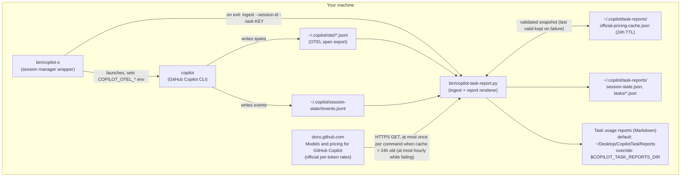
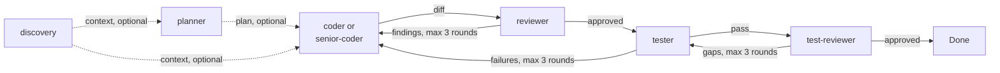

# Architecture

This document explains how the two pieces of the toolkit — the **session
manager** (`copilot-s`) and the **task usage reporter**
(`copilot-task-report.py`) — fit together, and how the **multi-agent
pipeline** (`agents/*.agent.md` + `instructions/copilot-instructions.md`)
is wired into a Copilot CLI session. It's written for someone evaluating or
extending the toolkit, not just using it.

> **History note:** prior to 2.0.0 this reporter was Jira-specific
> (`copilot-jira-report.py`, `~/.copilot/jira-reports/`, `tickets/`,
> `~/Desktop/CopilotJiraTaskReports`). See the
> [CHANGELOG's 2.0.0 entry](../CHANGELOG.md) for the rename and the
> automatic migration of existing data.

## Component overview

## 1. `copilot-s` — session manager

`copilot-s` is a Bash wrapper around the `copilot` CLI binary. It does not
replace or fork `copilot`; it manages metadata *around* invocations of it:

- **Session index** — a flat file (`~/.copilot-sessions`, format
  `session_id|name|timestamp|cwd`) tracking every known session across all
  working directories, so you can list/resume/delete sessions from anywhere.
- **OTEL wiring** — before launching `copilot`, it sets
  `COPILOT_OTEL_ENABLED=true`, `COPILOT_OTEL_EXPORTER_TYPE=file`, and a
  fresh per-invocation `COPILOT_OTEL_FILE_EXPORTER_PATH` under
  `~/.copilot/otel/`. This is what makes the task usage reporter possible —
  see below.
- **Task ID resolution** — on session start/resume/exit, it tries to
  extract a conservative `KEY-123`-style ID (`[A-Z][A-Z0-9]+-[0-9]+`) from
  the current git branch, falling back to the resumed session's stored
  branch, and finally prompting the user (with input validation and
  retry) for a brand-new session with no detectable ID — accepting either
  a `KEY-123`-style ID or a free-form task name.
- **Exit hooks** — after `copilot` exits, before the keep/rename/delete
  prompt (and before any session directory is deleted in the bulk-delete
  flow), it calls `copilot-task-report.py ingest` non-fatally: a failure
  here is reported as a warning and never blocks the keep/rename/delete
  flow.

`copilot-s` is intentionally the *only* place that knows about git branches,
terminal prompts, and the session index; it treats the reporter as an
external, swappable helper it shells out to.

## 2. `copilot-task-report.py` — usage aggregator

A stdlib-only Python script, invoked by `copilot-s` (or standalone via
`--report`/`--task`). It has three responsibilities: **ingest** new
telemetry, **merge** it into a per-task aggregate, and **render** that
aggregate as Markdown.

### Data sources

| Source | What it provides | Why it's needed |
|---|---|---|
| OTEL span files (`~/.copilot/otel/copilot-otel-*.jsonl`) | Per-call model, token counts (prompt/completion/reasoning/cache-read), call duration, and (when present) the per-call reasoning-effort level | This is the **primary** source — the real conversation model calls. `events.jsonl`'s own model-call events only cover small internal utility calls, not the primary chat turns. |
| `events.jsonl` (per session, under `~/.copilot/session-state/<id>/`) | Configured reasoning-effort timeline (`session.start`/`resume`/`model_change`), cumulative Copilot-internal usage checkpoints (`session.usage_checkpoint`), and subagent start/complete pairs | **Secondary** source, ingested independently of OTEL — a missing/late-arriving file on either side never blocks the other. |
| Official GitHub pricing ([article body API](https://docs.github.com/api/article/body?pathname=/en/copilot/reference/copilot-billing/models-and-pricing), cached as `~/.copilot/task-reports/official-pricing-cache.json`) | Official USD per 1M tokens per model: input, cached input, cache write (rate / "Not applicable" / column absent), output, and Default vs Long-context tiers with their input-token threshold | Turns each call's tokens into an estimated USD cost at ingestion. Strictly parsed (any unsupported table schema, price cell, tier or threshold rejects the whole refresh); snapshot stores fetch time, source URL and content SHA-256 (no effective date is published). |
| `config/model-pricing.json`, `config/request-pricing.json` (installed only if absent) | Legacy approximate per-token table and company fixed per-request policy | **Inactive** — no longer read by the default report. User copies are preserved untouched; the fixed-charge helpers remain in the code, dormant. |

### Ingest semantics (why it's safe to run repeatedly)

- **Byte-offset tracking per file** — each OTEL file and each session's
  `events.jsonl` has its own tracked read offset in
  `~/.copilot/task-reports/session-state.json`. Re-running ingest with no
  new bytes is a no-op; re-running with new bytes only processes the new
  bytes.
- **Install-epoch gating** — usage is only ever counted from the moment the
  toolkit was first used on a machine (an install marker timestamp). A
  session resumed after install has its very first ingest seeded to skip
  straight past its pre-install bytes, with OTEL spans additionally checked
  directly against the install epoch as a backstop.
- **Checkpoint deltas, not cumulative totals** — Copilot's own
  `session.usage_checkpoint` events report *cumulative* usage; the reporter
  tracks the last-seen cumulative value and only books the forward delta,
  so re-ingesting never double-counts and a resumed pre-install session's
  first post-install checkpoint doesn't book its entire lifetime total.
- **Timestamped effort timeline** — a mid-session change to the configured
  reasoning effort only relabels calls that happened *after* the change,
  never calls that already happened before it.
- **Joint model × effort aggregation** — alongside the separate `by_model`
  and `by_effort` tables, each task stores `by_model_effort`
  (`{model: {effort_key: aggregate}}`), originally for the (now dormant,
  no longer rendered) per-(model, effort) fixed request charge; it is still
  recorded so existing data stays consistent. Task files persisted before this field
  existed get it started empty (with a `by_model_effort_since` timestamp);
  their earlier requests are reported as explicitly *unattributed*, never
  backfilled by guessing a split from the two marginal tables.
- **Official pricing refresh** — `ingest` and `report` call
  `refresh_official_pricing_if_due()` once (memoized per process) *before*
  taking the ingest lock, under its own `.official-pricing.lock`. It fetches
  only if the cache is missing/invalid/older than 24h, with a 1 MB cap and
  a 10s timeout per socket operation; the 20s total deadline is checked only
  between body reads. These limits are best effort, not a hard deadline: the
  socket timeout applies per operation (each receive), so a server streaming
  headers or body slowly, slow DNS resolution, or a pricing-lock wait can
  push an attempt past the nominal timeout, with no fixed upper bound. Only a
  Python `ssl.SSLCertVerificationError` (raw or as `URLError.reason`) makes
  the default fetcher retry once via the system `curl` (`-q` first so
  `~/.curlrc` is ignored, `--fail`, `--proto =https`, no `-L`, verification
  on, `--max-time 20`, `--max-filesize` plus a bounded chunked stdout read,
  fixed argv without a shell, fixed URL only; HTTP 200 and the unchanged
  effective URL are required via a `--write-out` trailer) and notes it on
  stderr; all other errors take the normal failure path. Injectable
  `PRICING_FETCHER`; `COPILOT_TASK_REPORT_PRICING_FETCH=0` disables the
  network. A failure (network/`OSError`, protocol, parse or validation
  error — handled by explicit exception types, not a blanket catch) writes
  `official-pricing-refresh-state.json`, warns on stderr, keeps the last
  valid cache, and suppresses retries for 1h, so a failing source is
  retried at most hourly. A cached snapshot is used for pricing only while
  it is at most 7 days past its fetch time (`fetched_epoch`/`fetched_at`:
  download time, not a rate effective date); older (or future-dated) it is
  kept for reference and new calls are recorded unpriced with a fixed
  reason. Cache validation covers every field used later (ids, URLs, unit,
  `snapshot_id` == `sha256:` + first 16 hex of `content_sha256`,
  `fetched_at` consistent with `fetched_epoch`, string display names /
  providers, `notes` as a list of strings, `lookup` equal to the one
  derived from the models); an invalid cache is rejected whole and
  re-fetched. A corrupted refresh-state file (bad UTF-8/JSON, non-numeric
  or negative/non-finite epochs/counters) is reset with a warning and shown
  in the report. Rendering, imports,
  `ensure-marker` and `normalize-task-id` never fetch.
- **Per-call official cost, recorded once** — `build_delta` prices each
  OTEL call with the snapshot in effect for that command (tier from the
  call's own input tokens; cache-read/cache-write as verified subsets of
  input; reasoning inside output, priced once; every Gemini/Google-provider
  call with reasoning tokens is conservatively unpriced because its output
  may exclude reasoning) and `merge_delta_into_task`
  adds the result to `task["official_cost"]`: per model, additive buckets
  keyed by snapshot id (calls, USD and its input/cached/cache-write/output
  components, tier counts) plus unpriced-call counts keyed by reason, and
  each snapshot's metadata once. Refreshes never reprice recorded buckets.
  Calls that predate `official_cost` on a task are rendered as *legacy*
  (`call_count` minus recorded priced/unpriced calls) — never backfilled.
- **Atomic, lock-protected writes** — the whole ingest cycle is wrapped in
  a best-effort cross-process file lock (`fcntl.flock`, falling back to
  unlocked operation if unavailable), and every file write goes through a
  temp-file-then-`os.replace` atomic write. Offsets/cursors are persisted
  *before* the task JSON, so a crash mid-ingest can only undercount on
  the next run, never double-count.
- **Truncation handling** — if a tracked file has shrunk since the last
  recorded offset (e.g. rotated/rewound), ingestion prints a warning and
  resumes from the file's current end rather than stalling forever or
  risking a double-count reread.
- **Attribution (versioned, additive)** — `merge_delta_into_task` starts a
  `task["attribution"]` block (`schema_version` 1) the first time a task is
  ingested by this version, freezing the task's existing totals as
  `legacy`. Every new call is added to `unknown`, keyed by an explicit
  reason: OTEL chat spans carry no observed agent/invocation identifier, and
  calls are never attributed from timestamps, models, or agent intervals.
  `legacy + unknown (+ attributed, always 0) == totals` is checked at render
  time. A future evidenced join would add a separate bucket under a new
  schema version. No per-agent cost is computed; `official_cost` is
  untouched. An unsupported/malformed block is left unchanged and shown as
  unreadable.
- **Observed invocation registry** — `subagent.started`/`subagent.completed`
  events that carry an `agentId` are stored under
  `attribution.observed_invocations[<session id>][<agentId>]` (agent name,
  started/completed flags and timestamps, model, conflicting-observation
  count). Merging is idempotent per event kind (identical replays are
  no-ops; a differing value keeps the first and counts a conflict), the
  session-id key prevents cross-session collisions, and registry-only
  deltas (e.g. a lone `subagent.started`) are merged even without model
  calls. Registry presence is informational, not ownership; the
  self-reported `by_agent` table is unchanged. The existing cursor,
  partial-line, truncation and install-epoch semantics apply unchanged,
  including the undercount-not-double-count crash behavior (not
  exactly-once).
- **Review records** — `record-review --input <file>` validates one
  orchestrator-supplied reviewer/test-reviewer round record
  (`copilot-task-report.review-record` v1; strict fields, no defaults,
  duplicate JSON keys and NaN rejected, 64 KB cap), then under the ingest
  lock reads the task file strictly (an unreadable file is never
  overwritten), applies the bounded policy per `(task, cycle_id, stage)`
  — one record per round slot (so no second broad review), round N needs
  N−1, rounds ≤ 3, nothing after `escalated`, session changes never reset
  the budget. `approved` is not terminal: a later in-order focused round of
  the same cycle may check tests/fixes changed after the approval, and the
  report's stage outcome is the latest recorded round (a later
  non-approved round supersedes the approval and is not complete). It
  atomically writes `task["reviews"]`. An
  identical replay is a no-op; a conflicting one fails. A missing task file
  gets only `task_id` and `reviews`. It never ingests, fetches pricing,
  regenerates the report, or changes usage/attribution data; the report's
  *Recorded Reviews* section checks invocation ids against the registry by
  exact id at render time. `ingest` uses the same strict read before it
  reads any telemetry or writes session state: an existing task file that is
  unreadable, not a JSON object, or names another task (by `task_id`, else
  legacy `jira_key`, exact or normalized) makes it exit non-zero with a
  stderr message, leaving the task file, state file and offsets untouched
  (a missing file is still a new task).

### Effort intent labeling

Every model call is labeled with an effort intent and its source, in
priority order:

1. `measured:<level>` — the real per-call reasoning-effort attribute on
   that exact OTEL span.
2. `configured:<level>` — the session-level configured effort in force at
   the call's own timestamp (from the timestamped timeline above).
3. `inferred:<level>` — a static agent-role → effort guess, used only when
   a call falls inside a fully-*closed* custom-agent interval (both
   `subagent.started` and `subagent.completed` observed) and no configured
   value applies. An open/in-progress agent interval is never used for
   attribution.
4. `unknown` — no information available.

### Reports

`task_path()`/`report_path()` map a normalized task ID (or the literal
`UNASSIGNED`) to a JSON aggregate (`~/.copilot/task-reports/tasks/<ID>.json`)
and a rendered Markdown report. The reports directory defaults to
`~/Desktop/CopilotTaskReports` and can be overridden with the
`COPILOT_TASK_REPORTS_DIR` environment variable. Deleting Copilot sessions
never touches these files — they live independently of session storage.

## 3. Multi-agent pipeline

`instructions/copilot-instructions.md` is the orchestrator: loaded
automatically in every Copilot CLI session, it defines task tiers
(trivial/small/standard/complex/high-risk) and a stage-selection matrix
that picks which of the 7 roles run for a given task. Code review is
mandatory for every source/code modification batch: production source,
tests (including tester-authored tests), scripts, Storybook stories, and
executable or behavior-affecting configuration, even when no executable
behavior is added. Pure prose/docs and mechanical git-only operations
are normally exempt. Other stages remain
conditional, and skips are briefly disclosed to the user. Before substantive
work on standard/complex/high-risk tasks, or any broad discovery/design
planning at any tier, the instructions require explicit approval of the
proposed route: the stages and configured routing values, all skipped
groups and reasons, and choices to approve delegation, choose main-session
handling, or specify a custom route. Only minimal classification reads are
allowed beforehand. Cancellation or decline stops work. Routing approval
does not authorize implementation, plan-mode execution, tests, or commits;
significant route changes require renewed approval. This is an
orchestrator instruction, not deterministic CLI enforcement. Small/casual
implementation retains its automatic coder route, followed by review for
code changes; simple questions remain direct. There is no
`fixer` role: `coder`/`senior-coder` apply their own targeted fixes,
always at the same tier that did the original implementation, so a
review or test failure never restarts work from scratch at a different
tier. Findings return to the original implementer (`coder`,
`senior-coder`, or the main session when it authored the change), while
the main session must not review its own changes. Tester-authored test
defects return to `tester`; production-code defects return to the
original production-code author. A tester adding/editing tests after the
broad review triggers bounded focused verification of those newly changed
tests alongside prior findings and regressions, within the same four-call
total — not a redundant broad review or budget reset. If the budget is
exhausted with code unchecked, work stops for escalation. The
`test-reviewer` remains a test-coverage/quality gate and does not replace
correctness review of tester-authored code.

The bounded flow is: `discovery` (read-only, broad/unfamiliar context
only) and `planner` (ambiguity/design only, consumes discovery's output
instead of re-exploring) feed `coder` (routine CRUD/UI/standard logic;
writes and fixes production code only) or `senior-coder` (multi-file
architecture, async state, schema/data-model changes, deep structural
bugs, new services; writes and fixes production code only). `reviewer`
uses Sonnet 5.5 high/long-context by default for routine code changes and
Opus 5.5 high/long-context for senior-coder-authored, complex/high-risk,
or unknown-implementation-model changes. It does one comprehensive pass,
then at most 3 focused verification rounds checking prior findings,
regressions, and any newly changed tester-authored code, all within the
same four-invocation total — never a second broad review or budget reset —
before escalating to the user. `tester` only runs when behavior
merits testing, in a test/fix loop capped at 3 rounds before escalating;
it writes and runs tests only and never fixes production code itself.
`test-reviewer` only engages for complex/high-risk tasks, with the same
bounded one-pass-plus-3-rounds discipline as `reviewer`. Each
`agents/*.agent.md` file is a self-contained role definition (frontmatter
with `name`/`description`/`model`/`tools`, plus a prompt body) loaded by
the Copilot CLI's custom-agent mechanism; every frontmatter description
and body explicitly reinforces bounded scope, concise output, and no
duplicated work, since that's part of this pipeline's cost-control
design, not just documentation.

The default handoff order is implement → relevant tests (`tester` only when
new tests are needed; otherwise the built-in `task` route runs existing
ones) → one comprehensive `reviewer` pass over the full code-and-test batch
→ `test-reviewer` for complex/high-risk work, exchanging a compact handoff
manifest rather than per-file narration. Tests added after a coverage
review are re-run and focused-checked inside the same budgets of the same
work-item cycle (one `cycle_id` per requested work item, not the lifetime of
a task report). The
main session records each review round with `record-review` (see above);
reviewers stay read-only, and `cycle_id` scopes a budget to one requested
work item.

This is pure configuration — no code ties the pipeline to the session
manager or the task reporter. You can adopt just the agents, just the
session manager, or both.

## Known limitations

See the [README's task reporting section](../README.md#task-usage-reporting)
for the full, current list of documented tradeoffs (OTEL availability,
truncation gaps, USD estimate accuracy, etc.) — they are kept in one place
to avoid drift between this document and the README.
