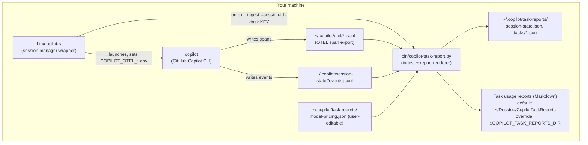
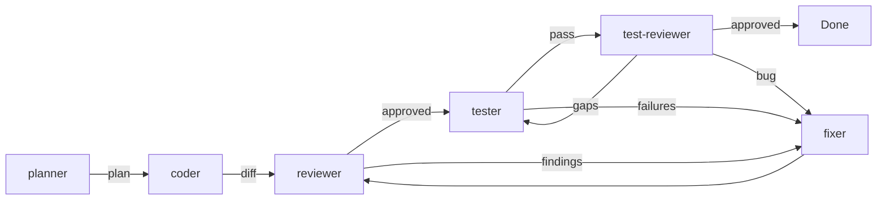

# Architecture

This document explains how the two pieces of the toolkit — the **session
manager** (`copilot-s`) and the **task usage reporter**
(`copilot-task-report.py`) — fit together, and how the **multi-agent
pipeline** (`agents/*.agent.md` + `instructions/copilot-instructions.md`)
is wired into a Copilot CLI session. It's written for someone evaluating or
extending the toolkit, not just using it.

> **History note:** prior to 2.0.0 this reporter was Jira-specific
> (`copilot-jira-report.py`, `~/.copilot/jira-reports/`, `tickets/`,
> `~/Desktop/CopilotJiraTaskReports`). See the
> [CHANGELOG's 2.0.0 entry](../CHANGELOG.md) for the rename and the
> automatic migration of existing data.

## Component overview

## 1. `copilot-s` — session manager

`copilot-s` is a Bash wrapper around the `copilot` CLI binary. It does not
replace or fork `copilot`; it manages metadata *around* invocations of it:

- **Session index** — a flat file (`~/.copilot-sessions`, format
  `session_id|name|timestamp|cwd`) tracking every known session across all
  working directories, so you can list/resume/delete sessions from anywhere.
- **OTEL wiring** — before launching `copilot`, it sets
  `COPILOT_OTEL_ENABLED=true`, `COPILOT_OTEL_EXPORTER_TYPE=file`, and a
  fresh per-invocation `COPILOT_OTEL_FILE_EXPORTER_PATH` under
  `~/.copilot/otel/`. This is what makes the task usage reporter possible —
  see below.
- **Task ID resolution** — on session start/resume/exit, it tries to
  extract a conservative `KEY-123`-style ID (`[A-Z][A-Z0-9]+-[0-9]+`) from
  the current git branch, falling back to the resumed session's stored
  branch, and finally prompting the user (with input validation and
  retry) for a brand-new session with no detectable ID — accepting either
  a `KEY-123`-style ID or a free-form task name.
- **Exit hooks** — after `copilot` exits, before the keep/rename/delete
  prompt (and before any session directory is deleted in the bulk-delete
  flow), it calls `copilot-task-report.py ingest` non-fatally: a failure
  here is reported as a warning and never blocks the keep/rename/delete
  flow.

`copilot-s` is intentionally the *only* place that knows about git branches,
terminal prompts, and the session index; it treats the reporter as an
external, swappable helper it shells out to.

## 2. `copilot-task-report.py` — usage aggregator

A stdlib-only Python script, invoked by `copilot-s` (or standalone via
`--report`/`--task`). It has three responsibilities: **ingest** new
telemetry, **merge** it into a per-task aggregate, and **render** that
aggregate as Markdown.

### Data sources

| Source | What it provides | Why it's needed |
|---|---|---|
| OTEL span files (`~/.copilot/otel/copilot-otel-*.jsonl`) | Per-call model, token counts (prompt/completion/reasoning/cache-read), call duration, and (when present) the per-call reasoning-effort level | This is the **primary** source — the real conversation model calls. `events.jsonl`'s own model-call events only cover small internal utility calls, not the primary chat turns. |
| `events.jsonl` (per session, under `~/.copilot/session-state/<id>/`) | Configured reasoning-effort timeline (`session.start`/`resume`/`model_change`), cumulative Copilot-internal usage checkpoints (`session.usage_checkpoint`), and subagent start/complete pairs | **Secondary** source, ingested independently of OTEL — a missing/late-arriving file on either side never blocks the other. |
| `config/model-pricing.json` (installed to `~/.copilot/task-reports/model-pricing.json`, user-editable) | USD/1M-token rates per model, plus an alias map | Turns raw token counts into an approximate, independent USD estimate. Models with no pricing entry (after alias resolution) are reported as "no pricing data", never silently priced at $0. |

### Ingest semantics (why it's safe to run repeatedly)

- **Byte-offset tracking per file** — each OTEL file and each session's
  `events.jsonl` has its own tracked read offset in
  `~/.copilot/task-reports/session-state.json`. Re-running ingest with no
  new bytes is a no-op; re-running with new bytes only processes the new
  bytes.
- **Install-epoch gating** — usage is only ever counted from the moment the
  toolkit was first used on a machine (an install marker timestamp). A
  session resumed after install has its very first ingest seeded to skip
  straight past its pre-install bytes, with OTEL spans additionally checked
  directly against the install epoch as a backstop.
- **Checkpoint deltas, not cumulative totals** — Copilot's own
  `session.usage_checkpoint` events report *cumulative* usage; the reporter
  tracks the last-seen cumulative value and only books the forward delta,
  so re-ingesting never double-counts and a resumed pre-install session's
  first post-install checkpoint doesn't book its entire lifetime total.
- **Timestamped effort timeline** — a mid-session change to the configured
  reasoning effort only relabels calls that happened *after* the change,
  never calls that already happened before it.
- **Atomic, lock-protected writes** — the whole ingest cycle is wrapped in
  a best-effort cross-process file lock (`fcntl.flock`, falling back to
  unlocked operation if unavailable), and every file write goes through a
  temp-file-then-`os.replace` atomic write. Offsets/cursors are persisted
  *before* the task JSON, so a crash mid-ingest can only undercount on
  the next run, never double-count.
- **Truncation handling** — if a tracked file has shrunk since the last
  recorded offset (e.g. rotated/rewound), ingestion prints a warning and
  resumes from the file's current end rather than stalling forever or
  risking a double-count reread.

### Effort intent labeling

Every model call is labeled with an effort intent and its source, in
priority order:

1. `measured:<level>` — the real per-call reasoning-effort attribute on
   that exact OTEL span.
2. `configured:<level>` — the session-level configured effort in force at
   the call's own timestamp (from the timestamped timeline above).
3. `inferred:<level>` — a static agent-role → effort guess, used only when
   a call falls inside a fully-*closed* custom-agent interval (both
   `subagent.started` and `subagent.completed` observed) and no configured
   value applies. An open/in-progress agent interval is never used for
   attribution.
4. `unknown` — no information available.

### Reports

`task_path()`/`report_path()` map a normalized task ID (or the literal
`UNASSIGNED`) to a JSON aggregate (`~/.copilot/task-reports/tasks/<ID>.json`)
and a rendered Markdown report. The reports directory defaults to
`~/Desktop/CopilotTaskReports` and can be overridden with the
`COPILOT_TASK_REPORTS_DIR` environment variable. Deleting Copilot sessions
never touches these files — they live independently of session storage.

## 3. Multi-agent pipeline

`instructions/copilot-instructions.md` is the orchestrator: loaded
automatically in every Copilot CLI session, it defines a strict pipeline
order (`planner → coder → reviewer ⇄ fixer → tester ⇄ fixer →
test-reviewer`) and the looping rules between review/fix and test/fix
stages. Each `agents/*.agent.md` file is a self-contained role definition
(frontmatter with `name`/`description`/`model`/`tools`, plus a prompt body)
loaded by the Copilot CLI's custom-agent mechanism.

This is pure configuration — no code ties the pipeline to the session
manager or the task reporter. You can adopt just the agents, just the
session manager, or both.

## Known limitations

See the [README's task reporting section](../README.md#task-usage-reporting)
for the full, current list of documented tradeoffs (OTEL availability,
truncation gaps, USD estimate accuracy, etc.) — they are kept in one place
to avoid drift between this document and the README.
